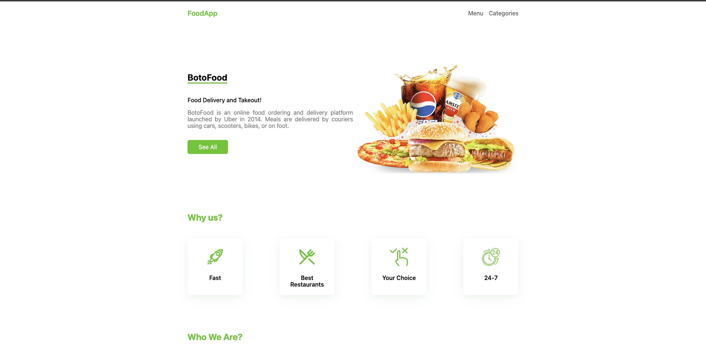

This is the English translation of the provided Persian text:
This project is a simulation of a food ordering website that simultaneously provides cooking recipes for food products. The main goal of this project is to practically demonstrate and implement advanced Next.js concepts, including Static Site Generation (SSG), Incremental Static Regeneration (ISR), and Server-Side Rendering (SSR) in a real-world scenario.

Key Features:
 * View Food and Product List: Displaying available food and products in the menu.
 * View Product Details: A dedicated page for each product with full descriptions, price, and ordering capability.
 * Food Recipes: Access to the complete cooking recipe for each dish.
 * Categories Page: Product Filtering: Ability to filter products based on Preparation Time and Difficulty Level.

## Getting Started


First, run the development server:

```bash
npm run dev
# or
yarn dev
# or
pnpm dev
# or
bun dev
```

Open [http://localhost:3000](http://localhost:3000) with your browser to see the result.

># **Demo**

[**Click here to see demo**](https://food-app-6puq.vercel.app/)

**`Desktop design`**

